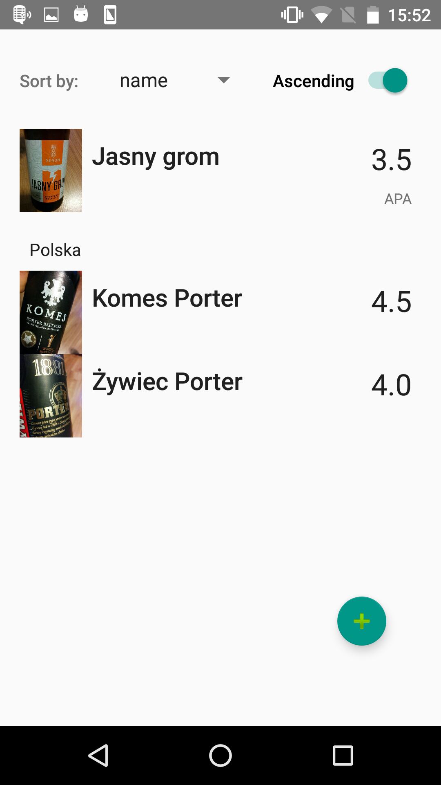
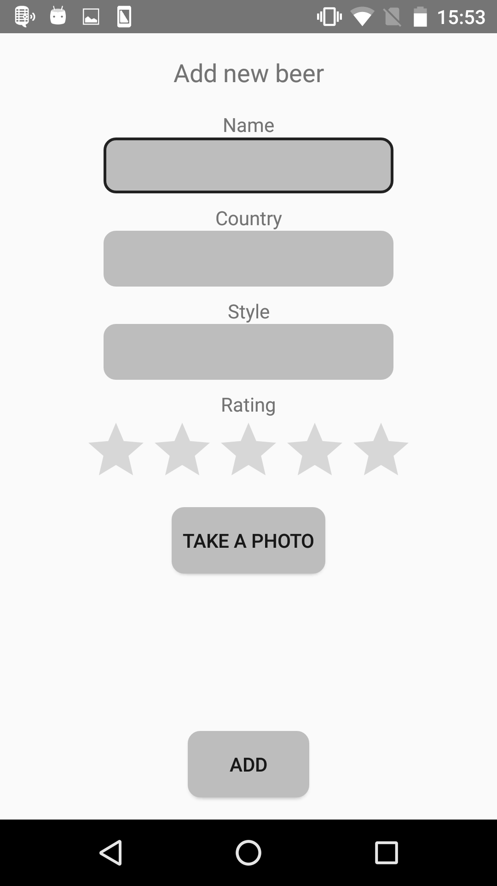
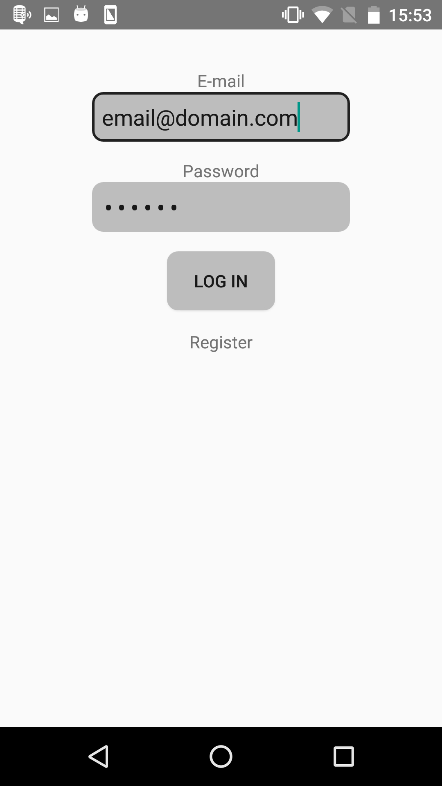

# BeerNotepad

A simple Android application to keep information and rating of tasted beers.
Allows user to create an account, log in and keep all information in a cloud service.

## Used technologies

* **Firebase** as a user login service and a database
* **Dagger2** for dependency injection
* **Mockito**, **JUnit** and **Espresso** for tests (unit and instrumentation)
* **Butterknife** for view injections
* **RxJava** for reactive design
* **Checkstyle** for static code quality analysis

## Modules

* **app** - main application module: Android related code
* **lib** - business logic module - presenters, model objects etc. Pure Java code.
* **data** - Firebase related module
* additional, will be moved to separate repos in the future:
  * **log** - logging module
  * **numeric** - number operations module

## Design assumptions

* Usage of MVP pattern
  * Lightweight `Activities` - view logic in separate `*View` classes
* Almost all classes immutable
* Dagger2 dependency injection in `Activities` and Espresso tests, plain constructor injection in other classes
